# kottans-frontend

## Stage 0. Self-Study

### General

0. [x] [Git Basics](#git-basics)
1. [x] [Linux CLI and Networking](#linux-cli-and-http)
2. [x] [VCS (hello gitty), GitHub and Collaboration](#git-collaboration)

### Front-End Basics
3. [x] [Intro to HTML & CSS](#intro-to-html-and-css)
4. [x] [Responsive Web Design](#responsive-web-design)
5. [x] [HTML & CSS Practice](#html-and-css-practice)
6. [x] [JavaScript Basics](#JS-basics)
7. [] [Document Object Model](#dom) - practice

### Advanced Topics

8. [] [Building a Tiny JS World (pre-OOP)](#building-a-tiny-js-world-pre-oop) - practice
9. [] [Object oriented JS](#object-oriented-js) - practice
10. [] [OOP exercise](#oop-exercises) - practice
11. [] [Offline Web Applications](#offline-web-applications)
12. [] [Memory pair game](#memory-pair-game) — real project!
13. [] [Website Performance Optimization](#website-perfomance-optimization)
14. [] [Friends App](#friends-app) - real project!

---

## Git Basics

I have already been introduced to git thanks to githowto.com, but learngitbranching.js.org helped a lot to understand it better.

Brand new for me was upstream.

## Linux CLI, and HTTP

---

#### Linux CLI

Since i am a Debian GNU/Linux user, new commands for me were just "more" and "finger".

## Linux CLI, and HTTP

  
Quiz 1

  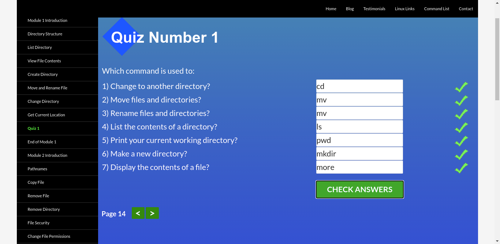

  
Quiz 2

  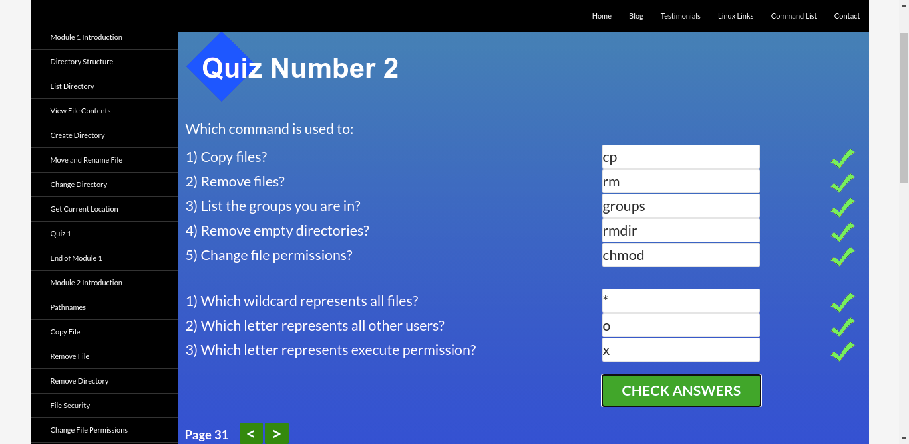

  
Quiz 3

  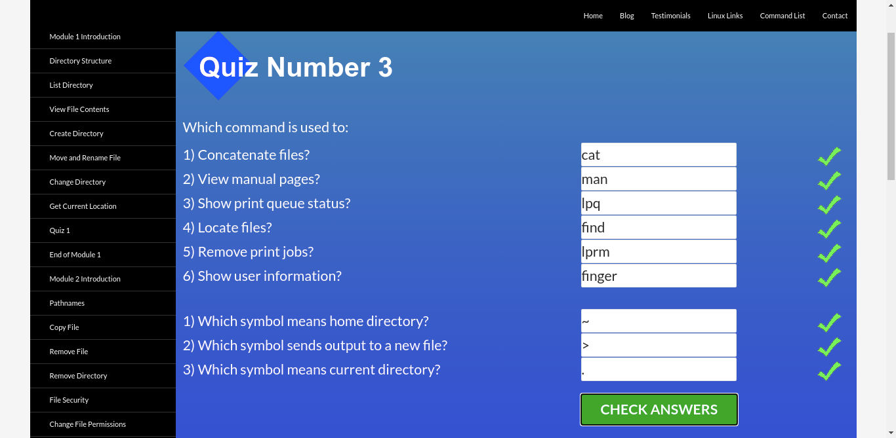

  
Quiz 4

  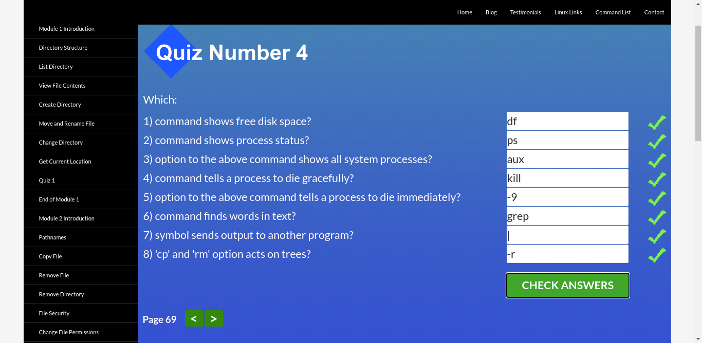

#### HTTP

Articles are very interesting. A lot of information, looking for the practical use of all this.

---
https://github.com/AntonKottans/friends-app
## Git Collaboration

Udacity GitHub & Collaboration lesson screenshoot

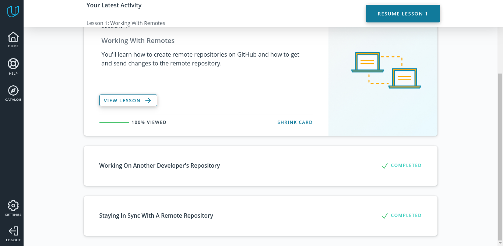

learngitbranching.js.org lesson screenshoots

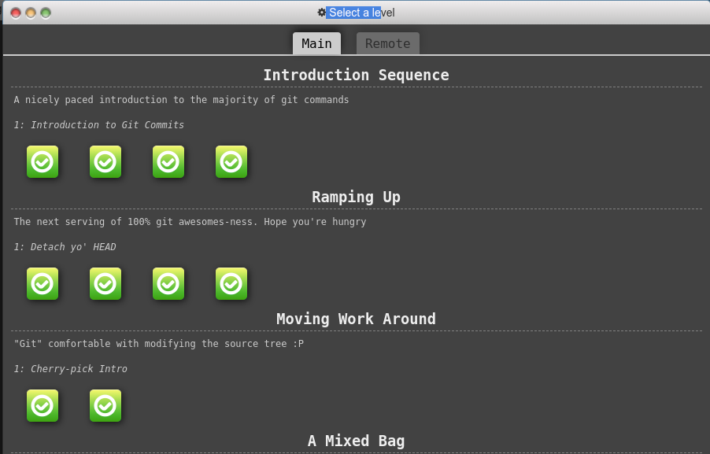
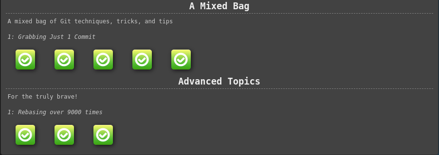
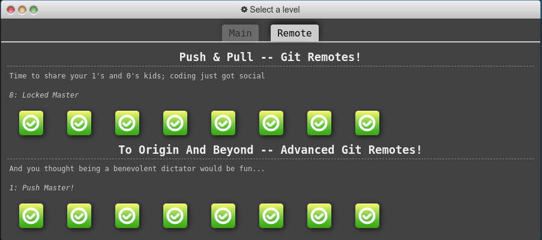

---

That was a lot of new information. My favorite `git fakeTeamwork`. And that was fun!

---

## Intro to HTML and CSS

udacity intro lessons screenshoots

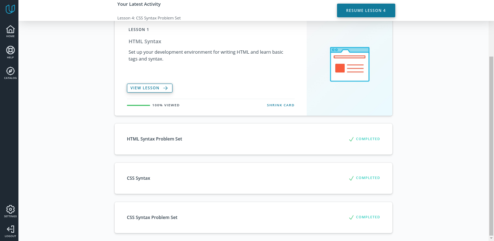

codecademy HTML lessons screenshoots

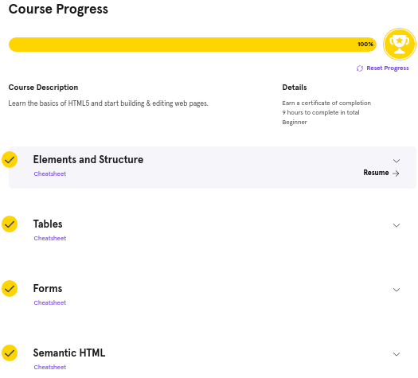

codecademy CSS lessons screenshoots

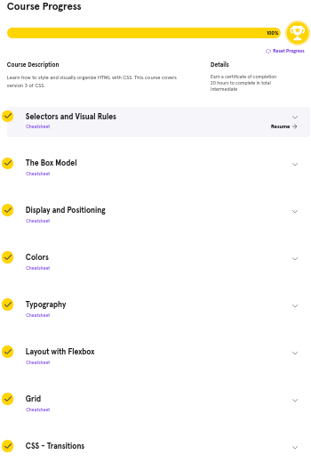

Though there was nothing complicated, last exercise in lesson about fonts was like "What do you want from me???". After reset i wrote the same and it worked. Codecademy's editor was good until lessons about flex and grid becouse of long loading and loosing connection while typing.

---

## Responsive Web Design

    
Udacity lessons screenshoot

        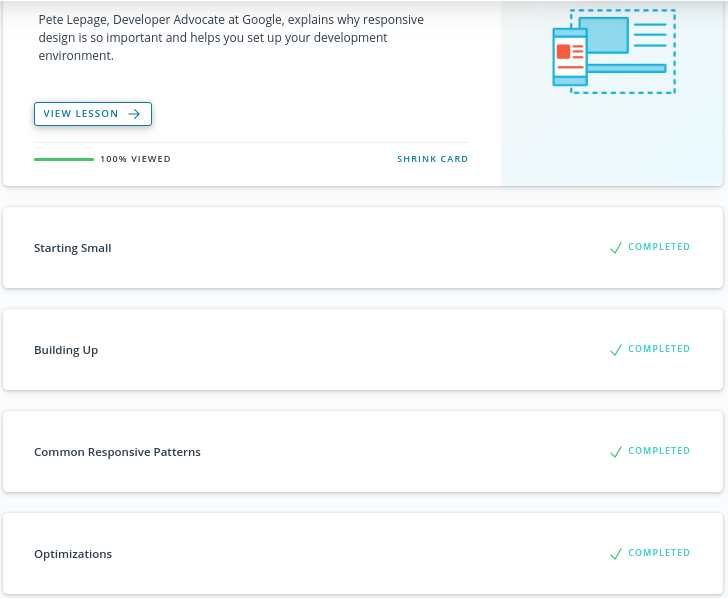

    
Froggy game screenshot

        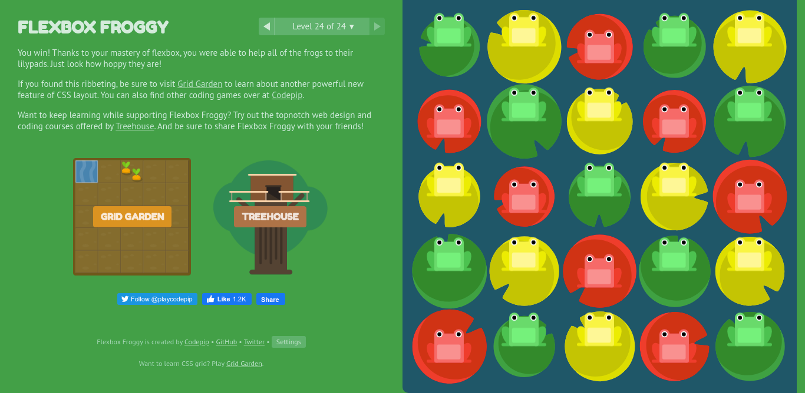

---

So that is debugging usb for! chrome://inspect + chrome canary = debugging on smartphone

keywords: hardware pixel, device independent pixel(dip), device pixel ratio(dpr), viewport, off canvas. Don't forget to set viewport!

Comfortable size of buttons for fat fingers - 48x48.
Comfortable width of text for reading - 45-90 caracters.

---

wrap-reverse wrap-reverse wrap-reverse

---

## HTML and CSS Practice

[DEMO](https://antonkottans.github.io/hooli-style-popup/)

Why i can't focus hidden checkbox? Cos i had to use 
    appearance: none; 
instead of 
    display: none;

---

## JS Basics

    
Udacity lessons screenshoot

        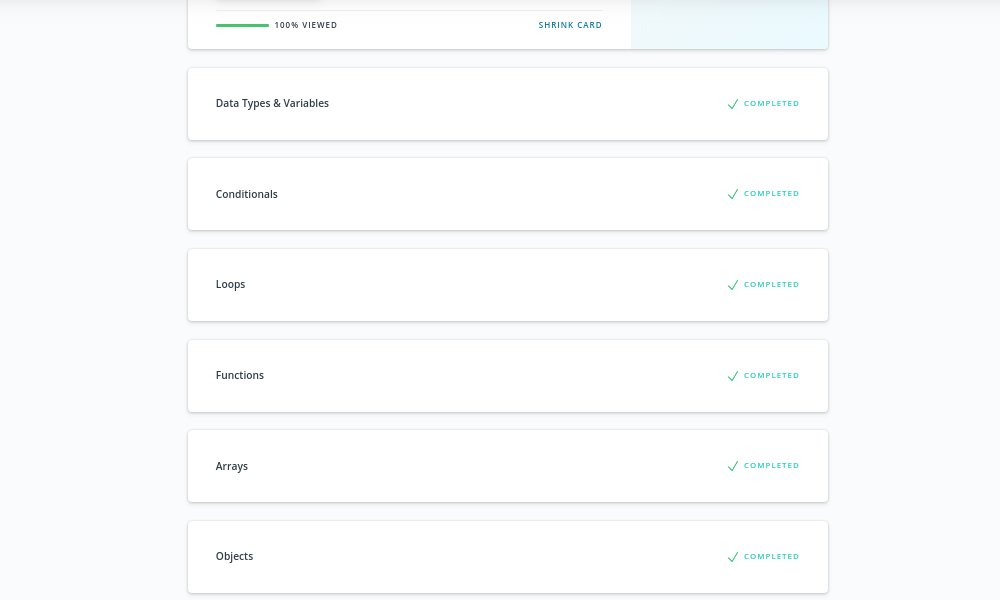

    
Free Code Camp

        

Something new: Object.freeze(Obj) - prohibits changes of object.

---

## DOM

    
Free code camp exercises

        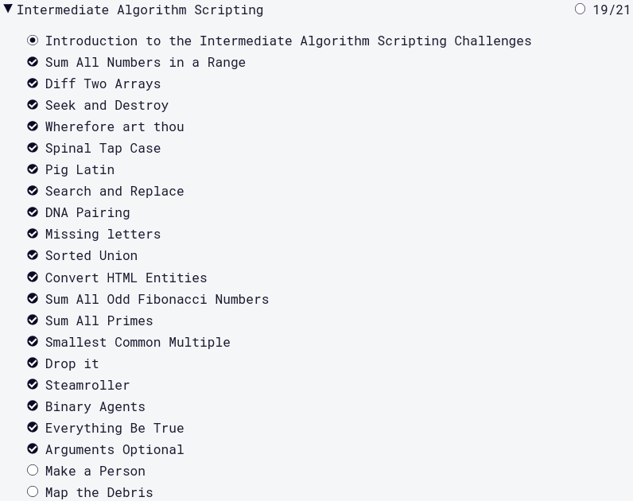

    
Udacity dom course

        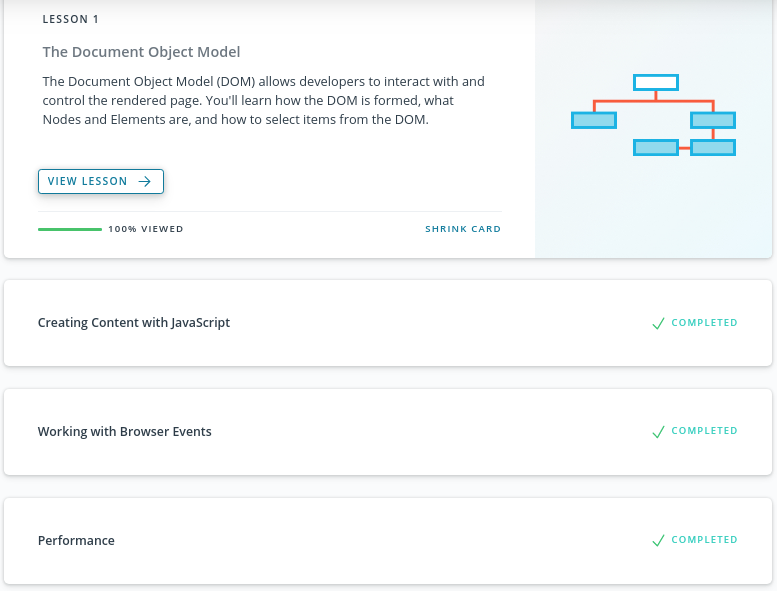

[Demo](https://antonkottans.github.io/js-dom/)

[Code](https://github.com/AntonKottans/kottans-frontend/tree/main/task_js_dom)

---

## Building a tiny js world pre oop

[Demo](https://antonkottans.github.io/a-tiny-JS-world/)

[Code](https://github.com/AntonKottans/a-tiny-JS-world/blob/populate-world/index.js)

---

## Object Oriented JS

    
Udacity oop theory

        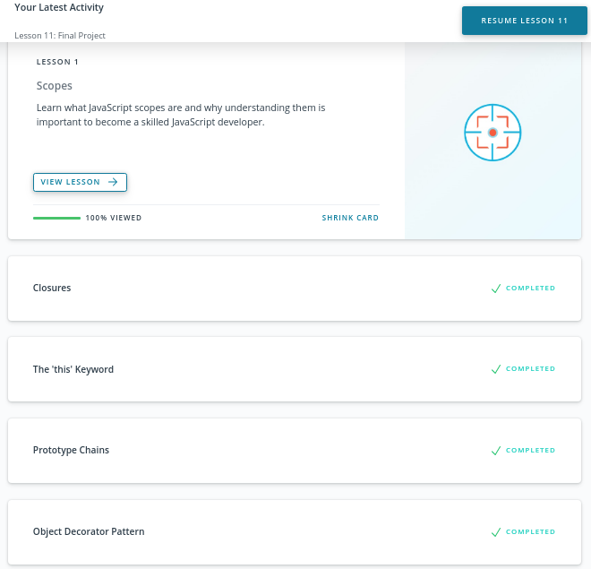
        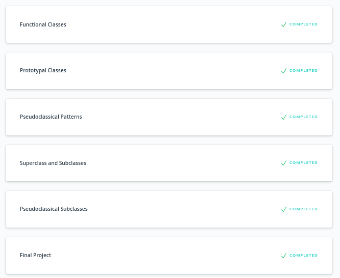

[Codewars](https://www.codewars.com/users/antonToxa)

    
Codewars screenshoot

        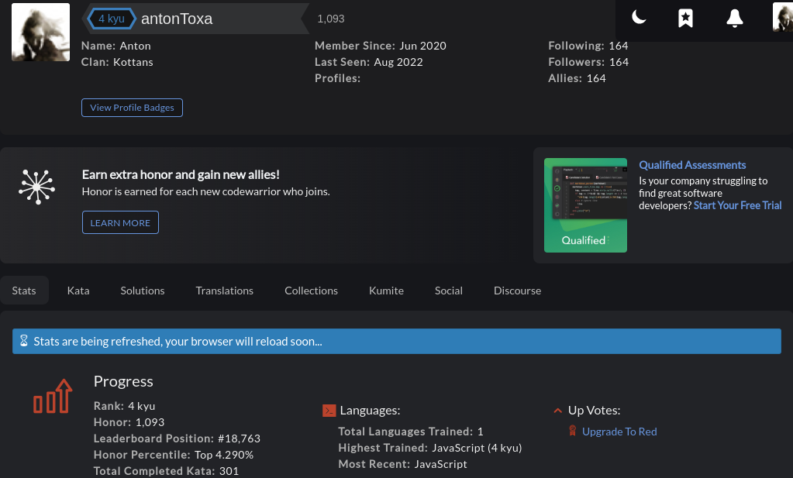

---

## Offline Web Applications

К сожалению, моих знаний английского недостаточно для усвоения большого количества видеоматериала. Можно было бы просто прощелкать кнопку 'Next', но знаний от этого не прибавится :)

Unfortunately, my knowledge of English is not enough to master a large amount of video material. I could just click the 'Next' button, but this will not add knowledge :)

Thus, for now, it's useless for me.

---

## Memory Pair Game

[Demo](https://antonkottans.github.io/memory-pair-game/)

[Code](https://github.com/AntonKottans/memory-pair-game)

---

## Friends App

[Demo](https://antonkottans.github.io/friends-app/)

[Code](https://github.com/AntonKottans/friends-app)
